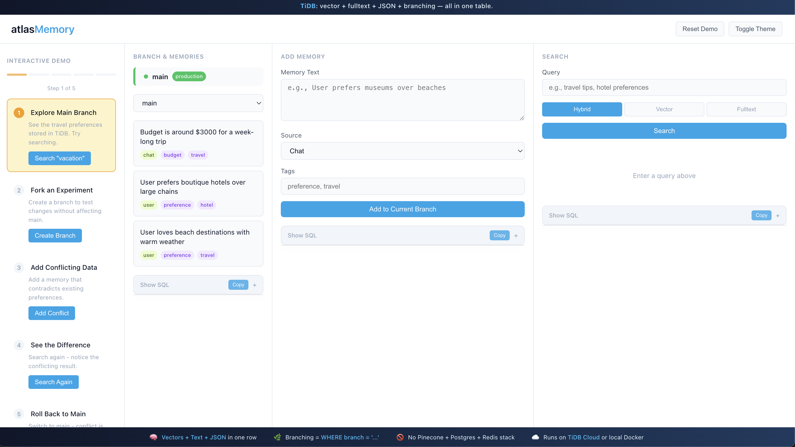

# atlasMemory



A Git-style memory layer for AI agents, built on TiDB. One table, three search modes (vector, full-text, hybrid), multi-tenant support, and branching for experiments and rollbacks. All in vanilla SQL. No Pinecone + Postgres + Redis stack to manage.

**[Live Demo](https://atlasmemory-production.up.railway.app)**

Other memory systems exist, but most don't give you branching, full-text, vectors together in a single distributed SQL database. If you want to experiment safely without juggling multiple services, this is a clean option.

## Architecture

```
┌─────────────────────────────────────────────────────────┐
│                      Your Agent                         │
└─────────────────────────┬───────────────────────────────┘
                          │
                          ▼
┌─────────────────────────────────────────────────────────┐
│                   atlasMemory                           │
│  ┌─────────────┐  ┌─────────────┐  ┌─────────────────┐  │
│  │ add_memory  │  │   search    │  │   branching     │  │
│  │             │  │  (vector,   │  │  (save_point,   │  │
│  │             │  │  fulltext,  │  │   switch,       │  │
│  │             │  │   hybrid)   │  │   delete)       │  │
│  └─────────────┘  └─────────────┘  └─────────────────┘  │
└─────────────────────────┬───────────────────────────────┘
                          │
                          ▼
┌─────────────────────────────────────────────────────────┐
│                   TiDB Serverless                       │
│  ┌─────────────────────────────────────────────────┐    │
│  │  memories table                                 │    │
│  │  ├─ id, user_id, branch                         │    │
│  │  ├─ text, metadata_json                         │    │
│  │  ├─ embedding VECTOR(384)                       │    │
│  │  └─ created_at                                  │    │
│  └─────────────────────────────────────────────────┘    │
│                                                         │
│  vec_cosine_distance() │ JSON queries │ Full-text      │
└─────────────────────────────────────────────────────────┘
```

## Why Branching Matters for AI Agents

Agents make mistakes. They go down wrong paths, hallucinate, or make decisions based on bad context. Without branching, you have two options: let the agent keep going with corrupted memory, or wipe everything and start over.

Branching gives you a third option: checkpoints.

**Before a risky operation:** Save a branch. If things go wrong, roll back. The agent can explore different approaches without permanently polluting its memory.

**A/B testing agent behavior:** Run the same agent with different memory states. Compare outcomes. Keep the branch that worked better.

**Multi-turn recovery:** User changes their mind mid-conversation? Branch back to before the wrong turn instead of awkwardly trying to "forget" things.

**Debugging:** Something went wrong three steps ago. Branch history lets you pinpoint when the memory state went bad.

The implementation is simple: every memory row has a `branch` column. Creating a branch copies rows to a new branch name. Switching branches is just a WHERE clause. No complex git internals, just SQL.

## Quickstart

```bash
git clone https://github.com/RealChrisSean/atlasMemoryDRAFT.git
cd atlasMemoryDRAFT
pip install -r requirements.txt
cp .env.example .env   # add your TiDB creds
python init.py
python examples/travel_agent_demo.py
```

## What it does

You store memories. You search them. You can branch off (like git) to experiment, then roll back if things go wrong.

```python
from atlas_memory import MemoryClient

client = MemoryClient(user_id="user-123")

client.add("User likes beach vacations", {"source": "chat"})
client.add("Budget is $3000")

results = client.search("vacation ideas")

# branch off to experiment
client.save_point("experiment")
client.add("User now hates beaches")

# go back to main - experimental data is gone
client.switch_branch("main")
```

## Why TiDB

Most setups need Pinecone for vectors, Postgres for metadata, maybe Elasticsearch for full-text. TiDB does all of it.

One table:

```sql
CREATE TABLE memories (
    id INT PRIMARY KEY,
    user_id VARCHAR(255),
    branch VARCHAR(255) DEFAULT 'main',
    text TEXT,
    metadata_json JSON,
    embedding VECTOR(384),
    created_at TIMESTAMP
);
```

Branching is just a WHERE clause. No infrastructure to manage.

## Web UI

```bash
python ui/app.py
# http://localhost:8000
```

Three panels: add memories, search with mode toggle (vector/fulltext/hybrid), manage branches. There's a "Show SQL" button so you can see what's actually hitting the database.

## Project layout

```
atlas_memory/     # core library
examples/         # demo script
ui/               # FastAPI + HTML frontend
tests/            # pytest
```

## Config

Create `.env`:

```
TIDB_HOST=gateway01.us-west-2.prod.aws.tidbcloud.com
TIDB_PORT=4000
TIDB_USER=your-user.root
TIDB_PASSWORD=your-password
TIDB_DB_NAME=atlas_memory
```

## Later

Not built yet, but on the list:

- LangChain/LlamaIndex adapters
- Agent integrations (Claude, OpenAI)
- TS wrapper
- Better hybrid reranking

## License

MIT
